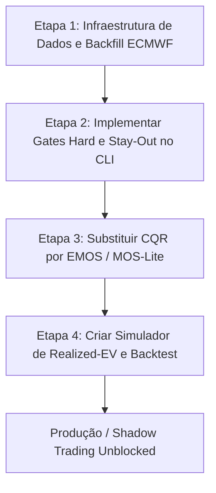

# Relatório de Investigação Forense: Wellington Tmax
**Status do Projeto:** `EXPERIMENT_ONLY` → Proposta de Transição para Produção  
**Autor:** Antigravity (AI Co-Pilot)  
**Data:** 11 de Junho de 2026  

---

## 1. Objetivo da Investigação Forense

Este documento apresenta um diagnóstico profundo das falhas estruturais, metodológicas e de calibração que impedem o projeto **Wellington Tmax (SolarStorm)** de atingir o nível de produção para atuação no mercado de previsão diária de temperatura máxima (*Tmax*) da Polymarket. 

Embora o projeto possua um excelente arcabouço quantitativo (validação aninhada walk-forward, modelagem de regimes e integração NWP), as melhorias marginais nos experimentos offline não se traduziram em um sistema de trading lucrativo e robusto.

O objetivo aqui é duplo:
1. **Identificar os gargalos e causa-raiz** do fraco desempenho histórico.
2. **Desenhar um caminho técnico claro e definitivo para produção**, baseando-se na literatura científica e nos aprendizados de três sistemas reais de trading de clima: `PolyWeather Pro`, `Kalshi-Polymarket Trader` e `Polymarket-Kalshi Weather Bot`.

---

## 2. Diagnóstico de Causa-Raiz (Onde Falhamos?)

A investigação forense do estado atual do repositório revela 5 gargalos centrais (G1 a G5):

### G1. O Caminho de Produção (Live) estava Rodando um Modelo Fraco
* **Sintoma:** No holdout recente (7 dias / 28 checkpoints), o modelo empírico (`core/baselines/empirical.py`) perdeu para o baseline trivial de persistência `dminus1` (MAE 2.32°C vs 2.00°C). O modelo colapsou seu $P50$ na moda em 93% das vezes e acionou a política de fallback marginal em 92.86% das previsões.
* **Causa-Raiz:** O caminho de serving promovia o baseline empírico em vez de servir os modelos Ridge locais (Onda 3F, MAE 1.062°C) ou os modelos aumentados com Open-Meteo (MAE 0.783°C). Não havia um **Gate de Promoção Rígido** que proibisse a entrada em produção de um modelo que não vencesse o melhor baseline local (*best-null*) por Checkpoint (CP).

### G2. O "Muro" de Calibração: CQR e a Granularidade Inteira
* **Sintoma:** A "Fase 5" de calibração foi fechada como `NOT_READY` (ver `reports/phase5_closure.md`). O CQR (Conformal Quantile Regression) apresentou supercobertura (*over-coverage*) sistemática (IC80 cobrindo ~92% em 2023 e 2025), e falhou no teste de heterocedasticidade (faixas estreitas cobriam ~84%, faixas largas cobriam ~100%).
* **Causa-Raiz:** 
  1. O CQR é um corretor ad-hoc aditivo. Se o modelo base (LightGBM com perda pinball) superestima a incerteza ou cruza quantis, o CQR tende a inflar ou falhar na granularidade inteira.
  2. Ajustar calibrações globais/recentes gerou drásticos drifts por ano e regime (piorando o MAE do macro regime *non-southerly* em 0.107°C em 2025). 
  3. Previsões de temperatura em mercados de Polymarket são liquidadas em intervalos inteiros (ex: `15°C`). Um modelo de regressão contínua mapeado para bins discretos sofre com o efeito de borda e dispersão assimétrica.

### G3. Risco de "Late Warming" (Late Spikes) Não Modelado em Produção
* **Sintoma:** O sistema é vulnerável a subidas tardias de temperatura após os checkpoints de corte (CP 20:00 a 23:00 UTC). A análise de erro mostra que os piores prejuízos ocorrem quando o modelo assume que a Tmax já foi atingida, mas fatores físicos provocam aquecimento tardio.
* **Causa-Raiz:** O modelo trata o tempo de forma estática. Não existe um classificador em tempo real de risco de *late warming* operando no serving de produção para forçar a abstenção (*stay-out*) ou acionar um modelo especializado.

### G4. Vazamento Temporal e Gaps Causa-Raiz de Dados NWP
* **Sintoma:** O modelo Open-Meteo experimental demonstrou grande ganho offline (MAE 0.783°C), mas o endpoint `single_runs` da ECMWF possuía apenas 35.8% de cobertura causal histórica pré-2024.
* **Causa-Raiz:** Treinar modelos em uma janela onde o dado mais forte (ECMWF) está ausente em 64.2% das datas gera um grave desajuste no live, onde o modelo tenta consumir features que não existiam no momento correspondente do treino (vazamento ou substituição inconsistente por GFS).

### G5. Ausência de Métrica de Decisão Financeira (Valor Esperado Realizado)
* **Sintoma:** O progresso do projeto é medido puramente por métricas meteorológicas tradicionais (MAE). No entanto, um modelo com MAE marginalmente pior, mas com caudas probabilísticas calibradas, pode ser muito mais lucrativo.
* **Causa-Raiz:** Falta um simulador de trading offline (*backtest/realized-EV harness*) que calcule o valor esperado das apostas (utilizando o critério de Kelly) contra os livros reais da Polymarket/Kalshi.

---

## 3. Aprendizados de Outros Projetos e Literatura Científica

Analisando os repositórios de referência (`PolyWeather`, `kalshi-polymarket-trader` e `polymarket-kalshi-weather-bot`) e a literatura meteorológica, identificamos soluções validadas para cada um dos nossos gargalos:

### 3.1. Arquitetura Multi-Pass (De `kalshi-polymarket-trader`)
O bot de trading da Kalshi implementa uma estratégia de 3 passos para evitar nowcasts espúrios e capturar mudanças bruscas de temperatura:
* **Pass 1 — Evening Scout (Véspera):** Baixa previsões de múltiplos modelos NWP. Se o desvio padrão (*spread*) entre os modelos for superior a um limite (ex: 3°F), o dia é classificado como de "alta incerteza" e bloqueado preventivamente para apostas de alta convicção.
* **Pass 2 — Morning Trade (Manhã):** Roda o modelo de post-processing com correção de viés sazonal ativo e executa a aposta inicial.
* **Pass 3 — Live Read (Em jogo):** Ingere continuamente leituras de METAR do aeroporto em tempo real. Se a temperatura observada divergir fisicamente da curva prevista (sinalizando um *late warming* ou entrada de frente fria precoce), o bot aciona uma **saída antecipada (hedging/exit)** para mitigar perdas.

### 3.2. Calibração Paramétrica EMOS/CRPS (De `PolyWeather` e Literatura)
O `PolyWeather Pro` utiliza **EMOS (Ensemble Model Output Statistics)** e calibração baseada em **CRPS (Continuous Ranked Probability Score)** em vez de corretores conformalizados como o CQR.
* **Fundamentação Científica (Gneiting et al., 2005 / Bremnes, 2021):** O EMOS ajusta uma distribuição paramétrica contínua (ex: Gaussiana ou Gamma Deslocada) onde a média é uma combinação linear dos termos NWP e a variância é proporcional ao spread do ensemble:
  $$\mu = a + b \cdot T_{NWP}$$
  $$\sigma^2 = c + d \cdot \text{Var}(Ensemble)$$
* O modelo é treinado minimizando diretamente o CRPS (que penaliza incerteza e recompensa calibração).
* **Vantagem:** Evita o muro da granularidade inteira gerando uma CDF paramétrica suave. A probabilidade de cada bin de aposta da Polymarket é simplesmente a diferença da CDF nos limites do bin: $P(\text{Tmax} \in [15, 16[) = F(16) - F(15)$.

### 3.3. Abstenção e Selective Prediction (Da Literatura de ML)
* **Conceito (Selective Prediction via Abstention, `arxiv:2203.10137`):** Em mercados preditivos de soma negativa (taxas + spread), o comportamento mais importante é o **Stay-Out** (não operar).
* **Solução:** Integrar um classificador de abstencão baseado em incerteza preditiva (ex: se a entropia da distribuição predita for muito alta, ou se os modelos NWP divergirem, o sistema emite `forecast_valid = False` e zera a posição máxima).

---

## 4. O Caminho para Produção: Plano de Ação Estruturado

Para mover o projeto Wellington Tmax de `EXPERIMENT_ONLY` para produção, propomos o seguinte plano de ataque em 4 etapas prioritárias, eliminando microajustes offline ineficazes:

### Etapa 1: Resolução do Gap de Dados NWP
* **Ação:** Executar o script `scripts/ecmwf_backfill_full.py` para completar o histórico da ECMWF `single_runs` no período de 2021-01 a 2023-12.
* **Métrica de Sucesso:** O script `scripts/live_nwp_availability_audit.py` deve retornar cobertura causal de ECMWF $\ge 95\%$ em todo o período histórico. Isso garante que o modelo treine exatamente com o mesmo set de features que verá no live.

### Etapa 2: Implementação de Gates Hard e Saída `Stay-Out`
* **Ação:** Modificar o pipeline de inferência em `solarstorm/baselines/_empirical.py` e `solarstorm/__main__.py` para incluir verificações mandatórias antes de gerar qualquer sinal de aposta:
  1. **Gate de Desempenho (*best-null*):** O MAE recente do modelo no checkpoint deve ser estritamente menor do que o melhor baseline (climatologia ou persistência).
  2. **Gate de Degradação (*fallback rate*):** Se a taxa de fallback para a média marginal for $> 40\%$ na janela recente, o sinal é invalidado.
  3. **Stay-Out Explícito:** Adicionar o campo `"forecast_valid": false` e `"stay_out_reason": "..."` no schema de saída do CLI quando os gates falharem.

### Etapa 3: Transição Metodológica de Calibração (CQR → EMOS/MOS-lite ou DRF)
* **Ação:** Abandonar os experimentos de CQR aditivos da Fase 5 e adotar uma modelagem de distribuição completa:
  * **Opção A (Recomendada - EMOS/MOS-lite):** Ajustar uma distribuição Gaussiana para o Tmax baseada no ponto de ancoragem do Open-Meteo mais o erro residual do LightGBM. A variância ($\sigma^2$) é modelada como uma função do desvio padrão recente do erro de previsão.
  * **Opção B (Alternativa - Distributional Random Forests):** Implementar o classificador de floresta distributiva (`zillow/quantile-forest` ou `MAPIE` com suporte a CDF) para extrair os quantis de forma não-cruzada.
* **Métrica de Sucesso:** Obter calibração ECE (Expected Calibration Error) $< 0.05$ por CP e cobertura de intervalo IC80 no intervalo estrito de $[0.78, 0.84]$ na validação cruzada 2022-2025.

### Etapa 4: Criação do Harness de Shadow Trading / Realized-EV
* **Ação:** Desenvolver um script de simulação financeira (`scripts/backtest_trading_ev.py`) que:
  1. Carregue o histórico de previsões probabilísticas calibradas (Etapa 3).
  2. Simule a precificação do mercado Polymarket para cada bin/intervalo.
  3. Calcule a vantagem (*edge*) do modelo: $\text{Edge} = P_{\text{model}} - P_{\text{market}}$.
  4. Aplique a fração de Kelly fracionária para dimensionar posições.
  5. Calcule o P&L acumulado, Drawdown Máximo e Sharpe Ratio.
* **Métrica de Sucesso:** Demonstração de P&L positivo consistente e CLV (Closing Line Value) médio positivo nos dados de teste 2023-2025.

---

## 5. Árvore de Decisão Contingencial para Produção

Para guiar a execução do plano de produção sem iterações desnecessárias, a seguinte árvore de decisão deve ser seguida pelo time de engenharia:

| Gatilho / Sintoma | Ação Recomendada | Impacto | Risco |
|---|---|---|---|
| Backfill da ECMWF falha ou encontra gaps permanentes | Pausar modelagem Open-Meteo; treinar exclusivamente com GFS `s3_grib` que possui 95.5% de cobertura | Evita vazamento temporal e overfitting | Baixo (perda de skill marginal de 0.04°C do ECMWF) |
| EMOS/MOS-lite não atinge calibração ECE < 0.05 | Utilizar regressão isotônica por bin nas probabilidades geradas pelo modelo local Ridge/LGBM | Corrige viés de calibração residual | Médio (pode achatar as probabilidades em eventos extremos) |
| O simulador de EV mostra retorno negativo devido ao *late warming* | Ativar a restrição de *stay-out* automática em todos os checkpoints após as 22:00 UTC se a tendência de pressão atmosférica estiver caindo e a cobertura de nuvens pré-CP for baixa | Protege o capital de perdas catastróficas | Baixo (reduz o número de trades, mas preserva a margem) |
| O MAE do modelo com Open-Meteo perde para o *best-null* local em CPs específicos | Forçar o serving a adotar o baseline local naquele CP específico, desativando a feature Open-Meteo para aquele corte | Mantém o leaderboard dinâmico e seguro | Baixo |

---

## 6. Conclusão e Recomendação Estratégica

O projeto **Wellington Tmax** possui sinal estatístico real (comprovado pela redução de MAE de 1.062°C no modelo local e 0.783°C com Open-Meteo). A fraqueza dos resultados não se deve à falta de dados ou modelos fracos, mas sim a um **erro de engenharia de produção**: a promoção de baselines inadequados ao vivo, a insistência no CQR para calibração de dados discretos inteiros e a falta de uma métrica de valor financeiro (EV).

A recomendação estratégica é **encerrar as tentativas de microajuste offline dos hiperparâmetros do LightGBM** e focar nas 4 Etapas do Plano de Produção acima. Isso nos dará um sistema de decisão calibrado, robusto e com um mecanismo de defesa (*stay-out* e *3-pass*) projetado para sobreviver a mercados reais de apostas de clima.
