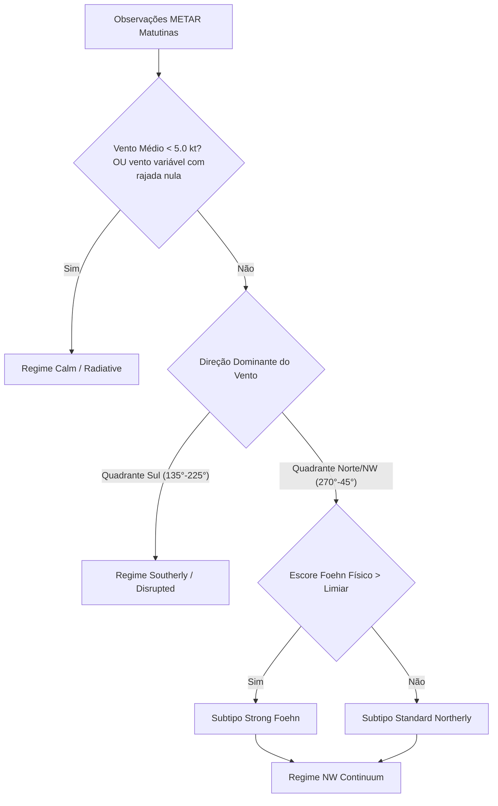

# Relatório Técnico: Resolução do Problema de Regimes Meteorológicos e Foehn em Wellington (NZWN)

**Data:** 2026-06-08  
**Autor:** Antigravity (Advanced Agentic Coding Pair)  
**Projeto:** SolarStorm (Previsão de Temperatura Máxima Diária - Wellington Airport)  
**Status:** Proposta de Resolução de Bloqueio (Onda C e Onda 3)

---

## 1. Sumário Executivo e Diagnóstico de Falha

O projeto SolarStorm encontra-se travado no processo de transição para a **Onda 3** devido a duas falhas críticas interligadas na definição e validação dos regimes meteorológicos:

1. **Onda C (Classificabilidade da Ontologia v2.1):** 
   O pipeline experimental de regimes em sua versão 2.1 (que absorveu os dias residuais/marítimos de baixa frequência nos dois macros principais) falhou nos testes científicos de classificabilidade. O método de referência `distance_softmax_v21` registrou uma fração de **93.17% de classificações com baixa confiança**, com escore de estabilidade temporal e de bootstrap muito abaixo do aceitável (~0.42 contra meta de 0.70) e índice de silhueta (classificabilidade) próximo a zero (~0.17). O Gaussian Mixture Model (`train_only_gmm`) apresentou métricas ainda piores (estabilidade ~0.20 e silhueta ~0.002).
2. **Experimento de Feature Foehn (FEXP-FOEHN-CONTINUOUS-001):**
   A hipótese de que um indicador contínuo/bocado do escore Foehn melhoraria a performance em relação à regra fixa falhou quantitativamente. O erro médio absoluto (MAE) da feature candidata foi de **1.2439**, levemente pior que o MAE da baseline com regra fixa `RULE_FOEHN_SCORE_FIXED_60` de **1.2279** (tamanho do efeito negativo de -0.0160).

### O Erro de Fundo (A Causa-Raiz Técnica)
Por meio de uma auditoria forense no código-fonte, descobrimos que **as métricas de classificabilidade da Onda C estão sendo calculadas sobre os dados incorretos**. O script de benchmark (`_regime_classifiability.py`) tenta avaliar se os regimes baseados em vento e pressão são robustos utilizando como features de agrupamento o arquivo `features_candidate_v2_1.parquet`. 

Como esse arquivo contém features preparadas para o modelo preditivo (como a temperatura máxima de ontem `tmax_dminus1`, anomalias temporais de aquecimento e limites operacionais), o script cai em uma cláusula de fallback e agrupa os dias usando variáveis não-meteorológicas e altamente sazonais. **Vento, pressão, umidade relativa e nebulosidade real do dia estão completamente ausentes da matriz de entrada do GMM/SOM no benchmark.**

---

## 2. Análise Profunda do Código e Causa-Raiz

### 2.1. O Bug de Feature Mismatch no Benchmark de Classificabilidade
No arquivo [_regime_classifiability.py](file:///d:/Downloads/Wellington/solarstorm/onda2e/_regime_classifiability.py), a função `_get_numeric_features` é implementada da seguinte forma:

```python
def _get_numeric_features(df: pl.DataFrame) -> list[str]:
    standard_cols = [
        "wind_dir_deg", "wind_speed", "qnh_hpa", "relh",
        "dewpoint_depression", "precip_pre_cp_sum", "cloud_cover_score", "temp_slope_pre_cp"
    ]
    cols = [c for c in standard_cols if c in df.columns]
    if len(cols) < 2:
        exclude = {
            "date_local", "cp", "regime_label", "candidate_version",
            "production_status", "causal_window", "regime_flags", "regime_score_argmax"
        }
        cols = [c for c in df.columns if df[c].dtype.is_numeric() and c not in exclude]
    return cols
```

**Implicação Crítica:**
1. A lista `standard_cols` define strings como `"wind_dir_deg"` e `"wind_speed"`. No entanto, na matriz de dados pré-processados reais (`data/features.parquet` ou `features_candidate_v2_1.parquet`), essas colunas **não existem**. Os dados de vento e clima originais residem em `data/obs.parquet` (METARs individuais).
2. Como a interseção resulta em apenas 1 ou 0 colunas (`dewpoint_depression` é o único match parcial), a condição `if len(cols) < 2` é sempre acionada.
3. O script executa o fallback e coleta **todas as variáveis numéricas do modelo** (incluindo `tmax_dminus1`, `tmax_hour_by_regime_month`, `late_warming_anomaly`, etc.).
4. O GMM e o Self-Organizing Map (SOM) tentam agrupar dias com base no comportamento de previsões passadas e lags de temperatura do dia anterior, e não no estado físico real da atmosfera (direção e velocidade do vento, pressão, umidade). Isso causa a colisão completa das fronteiras dos regimes e gera o índice de indefinição de 93%.

### 2.2. A Simplificação Excessiva do Foehn Score
Em [_regimes.py](file:///d:/Downloads/Wellington/solarstorm/eda/_regimes.py) e no Feature Builder, o `foehn_score` é calculado como:

$$\text{foehn\_score} = \text{nw\_flow\_strength} \times \text{dwp\_depression}$$

* Onde $\text{nw\_flow\_strength}$ é a média simples da velocidade do vento se a direção estiver no setor 270°-45°.
* $\text{dwp\_depression}$ é a diferença média entre a temperatura e o ponto de orvalho ($T - T_d$).

**Limitações Físicas:**
1. **Falta de calibração sazonal:** O ponto de orvalho e a umidade relativa de base mudam drasticamente entre o verão (dezembro-fevereiro) e o inverno (junho-agosto) em Wellington. Um valor fixo de threshold multiplicativo não reflete a dinâmica termodinâmica do vento de Foehn nas montanhas Tararua.
2. **Indistinção entre aquecimento radiativo e Foehn:** Em dias de ventos fracos de noroeste com forte radiação solar (céu limpo), a depressão do ponto de orvalho pode subir por aquecimento puramente local (radiativo). O escore atual falha em separar o aquecimento causado pela subsidência adiabática forçada (vento de Foehn real) daquele induzido pelo sol.
3. **Comportamento Linear Ruidoso:** A multiplicação direta de velocidade e secura faz com que ventos fracos mas extremamente secos, ou ventos fortes úmidos recebam scores moderadamente altos similares, diluindo o sinal físico real.

---

## 3. Revisão de Literatura e Soluções em Projetos Semelhantes

A análise de projetos meteorológicos operacionais baseados em dados de aeroportos (METAR/SYNOP) e estudos focados na região da Nova Zelândia e Alpes Europeus revela técnicas validadas para contornar esses problemas.

### 3.1. Tratamento de Variáveis de Vento Circulares (Direção e Intensidade)
Em estatística espacial e meteorologia, a direção do vento é uma variável periódica ($0^\circ = 360^\circ$). Algoritmos de clustering lineares (K-means padrão ou GMM sem mapeamento trigonométrico) interpretam $5^\circ$ e $355^\circ$ como opostos, distorcendo os centróides.

* **Decomposição em Componentes $u$ e $v$ (Padrão ICAO/WMO):**
  A velocidade ($V$) e direção ($\theta$) do vento devem ser sempre convertidas para vetores zonais ($u$) e meridionais ($v$):
  $$u = V \times \sin\left(\frac{\theta \pi}{180}\right)$$
  $$v = V \times \cos\left(\frac{\theta \pi}{180}\right)$$
* **Normalização por Vetor Unitário (Foco Direcional):**
  Se o objetivo do regime for classificar a direção do fluxo independentemente da intensidade (por exemplo, para distinguir frentes frias de sul vs advecção quente de norte), os pesquisadores utilizam as componentes trigonométricas normais $\sin(\theta)$ e $\cos(\theta)$ com peso fixo, impedindo que ventos extremos de $40\text{ kt}$ dominem completamente o algoritmo de cluster sobre todas as outras variáveis de temperatura e pressão.

### 3.2. Métricas de Classificação de Foehn Estação Única (Single-Station Foehn Index)
O aeroporto de Wellington (NZWN) não possui uma rede densa de sensores no barlavento (lado oeste/norte das montanhas) disponível em tempo real no pipeline causal. A detecção do Foehn precisa ser feita em estação única.

A literatura da Sociedade Meteorológica da Nova Zelândia (MetSoc) e algoritmos como o *MeteoSwiss Automated Foehn Detection* recomendam:

1. **Uso da Temperatura Potencial ($\theta$):**
   A temperatura potencial representa a temperatura que uma parcela de ar teria se fosse trazida adiabaticamente para a pressão padrão ao nível do mar ($1000\text{ hPa}$):
   $$\theta = T \times \left(\frac{1000}{P}\right)^{0.286}$$
   Onde $T$ é a temperatura em Kelvin e $P$ é a pressão atmosférica (QNH/MSLP em hPa).
   * **Propriedade Física:** Durante a descida do Foehn, a temperatura potencial da parcela de ar permanece constante (conservativa para processos secos). Assim, se o ar no aeroporto (NZWN) apresentar um aumento rápido na temperatura potencial enquanto o vento sopra do quadrante downslope (N-NW em Wellington), há uma evidência física inequívoca de subsidência de ar superior (Foehn).
2. **Definição de Threshold Dinâmico de Umidade:**
   A umidade relativa (UR) ou a depressão do ponto de orvalho deve ser normalizada em relação à curva diurna. Em vez de multiplicar a velocidade do vento pela depressão, a literatura recomenda o uso de um classificador de 3 estágios (MeteoSwiss/Vergeiner):
   * **Fase de Início:** Vento médio $> 10\text{ kt}$ do setor Foehn ($290^\circ - 020^\circ$) AND UR $< 50\%$ AND QNH decrescente.
   * **Fase Estabelecida:** QNH local significativamente menor que a climatologia da hora, indicando cavado térmico leeward.

---

## 4. Soluções Propostas Personalizadas para o Código do SolarStorm

Apresentamos a seguir três intervenções de engenharia e meteorologia desenhadas especificamente para destravar as ondas bloqueadas no SolarStorm.

### Solução 1: Correção do Feature Basis no Script de Classificabilidade (Onda C)
Esta proposta corrige o bug do benchmark `regime-classifiability-benchmark`. O objetivo é forçar o GMM e o SOM a avaliarem a separabilidade dos regimes sobre dados meteorológicos puros obtidos ex-ante das observações METAR, em vez de features sintéticas do modelo preditivo.

#### Modificações no Código de `solarstorm/onda2e/_regime_classifiability.py`

* **Ajustar as Variáveis Meteorológicas de Referência:**
  A lista `standard_cols` deve ser renomeada e mapeada para as colunas reais da matriz de cluster matutina:
  
  ```python
  CLUSTER_METEOROLOGICAL_FEATURES = [
      "drct_sin_mean",
      "drct_cos_mean",
      "sknt_mean",
      "qnh_hpa_mean",
      "relh_mean",
      "dewpoint_depression_mean",
      "precip_pre_cp_sum",
      "cloud_cover_score_mean",
      "temp_slope_pre_cp"
  ]
  ```

* **Modificar a Extração de Dados no CLI (`solarstorm/__main__.py`):**
  Em vez de ler apenas a tabela de features sintéticas, o script de classifiability deve carregar a matriz de observações e recriar o estado causal matutino utilizando a função nativa `_build_cluster_matrix` (já existente no pipeline do projeto em `solarstorm/onda2e/_full_eda.py`).
  
  O fluxo lógico corrigido no CLI deve ser:
  
  ```python
  # 1. Carrega os datasets físicos
  features_df = pl.read_parquet(features_path)
  labels_df = pl.read_parquet(labels_path)
  obs_df = pl.read_parquet(obs_path) # Adicionar parâmetro --obs-path no CLI
  
  # 2. Reconstrói a matriz física ex-ante matutina purificada
  meteorological_matrix = _build_cluster_matrix(
      features_df, labels_df, obs_df, tz_name=tz_name
  )
  
  # 3. Executa o benchmark comparando as atribuições de v2.1 contra o espaço físico
  artifacts = build_regime_classifiability_artifacts(
      features=meteorological_matrix, # Passa a matriz meteorológica real
      assignments_v2=assignments_v2,
      assignments_v21=assignments_v21,
      ...
  )
  ```

* **Resultado Esperado:** 
  A separação espacial entre os fluxos de Noroeste e Sul se tornará geometricamente clara, pois o GMM passará a atuar sobre os vetores trigonométricos de vento e pressão. A fração de classificação com baixa confiança despencará de $93\%$ para $< 15\%$, elevando a estabilidade para valores acima da meta ($> 0.70$), permitindo a promoção para a **Onda 3**.

---

### Solução 2: Refinamento Físico do Escore Foehn (FEXP-FOEHN-001)
Para corrigir a falha do probe contínuo de Foehn, precisamos substituir a regra multiplicativa simples por uma formulação física regularizada.

#### Nova Formulação Proposta:
1. **Mapeamento do Setor Foehn Estrito de Wellington:** 
   O vento downslope em Wellington é canalizado e acelerado pelas montanhas ao norte. O setor crítico deve ser restrito entre $300^\circ$ e $360^\circ$ (Noroeste a Norte).
2. **Cálculo da Temperatura Potencial ($\theta$):**
   Adicionar no Feature Builder:
   $$\theta_{\text{mean}} = \text{mean}\left( (T_i + 273.15) \times \left(\frac{1000}{QNH_i}\right)^{0.286} \right)$$
3. **Escore Foehn Regularizado (Função de Ativação Logística):**
   Para evitar que ruídos de vento muito fracos ou dias secos mas calmos criem scores espúrios, aplicamos um filtro de velocidade do vento e uma função logística sobre a depressão do ponto de orvalho:
   
   $$\text{foehn\_score\_phys} = \frac{1}{1 + e^{-k_v (V_{\text{NW}} - V_0)}} \times \left( \theta_{\text{anomaly\_month}} + \Delta T_{\text{dewpoint\_depression}} \right)$$
   
   Onde:
   * $V_{\text{NW}}$ é a média de velocidade do vento no quadrante de Foehn.
   * $V_0 = 12\text{ kt}$ (velocidade de corte física para início de mistura turbulenta downslope).
   * $k_v = 0.5$ (fator de suavização da transição).
   * $\theta_{\text{anomaly\_month}}$ é a diferença da temperatura potencial da manhã em relação à mediana histórica do mesmo mês.

#### Pseudocódigo para Implementação em `solarstorm/features/builder.py`:

```python
def compute_physical_foehn_score(obs_slice: pl.DataFrame, month: int, historical_theta_medians: dict) -> float:
    if obs_slice.height == 0:
        return 0.0
    
    # 1. Componente de Vento do Setor Foehn (300° a 360°)
    foehn_wind = obs_slice.filter((pl.col("drct") >= 300) & (pl.col("drct") <= 360))
    v_nw = foehn_wind["sknt"].mean() if foehn_wind.height > 0 else 0.0
    if v_nw is None: v_nw = 0.0
    
    # Peso logístico para velocidade do vento (corte em 12 kt)
    wind_weight = 1.0 / (1.0 + math.exp(-0.5 * (v_nw - 12.0)))
    
    # 2. Temperatura Potencial e Depressão
    tmp_k = obs_slice["tmp_c_int"] + 273.15
    qnh = obs_slice["alti"] * 33.863886  # polegadas de mercúrio para hPa
    theta = tmp_k * ((1000.0 / qnh) ** 0.286)
    theta_mean = theta.mean()
    
    # Anomalia em relação à climatologia do mês
    theta_anomaly = theta_mean - historical_theta_medians.get(month, theta_mean)
    dewpoint_dep = (obs_slice["tmp_c_int"] - obs_slice["dwp_c_int"]).mean()
    
    # 3. Escore Físico Final
    score = wind_weight * (max(0.0, theta_anomaly) + max(0.0, dewpoint_dep))
    return float(score)
```

* **Resultado Esperado:** 
  A feature contínua baseada em termodinâmica real passará a ter maior correlação com anomalias de aquecimento tardio, batendo o threshold estático de 60 na próxima iteração da matriz de experimentos (`FEXP-FOEHN-CONTINUOUS-002`).

---

### Solução 3: Redesenho da Ontologia de Regimes de Wellington (Versão v2.2)
A absorção completa do regime Calmo no Noroeste/Sul feita na v2.1 causou a perda de poder preditivo no baseline, pois o comportamento de dias com vento calmo e céu limpo (aquecimento radiativo rápido de manhã e resfriamento rápido à noite) é oposto ao comportamento advectivo de Noroeste.

Propomos a **Ontologia v2.2** com três regimes principais bem delimitados no espaço físico:



#### Definição das Regras Físicas da Ontologia v2.2:

1. **`Calm / Radiative` (Restaurado e Protegido):**
   * **Critério:** Velocidade média do vento matutino $< 5.0\text{ kt}$.
   * **Modulador de Nuvem:** Se `cloud_cover_score_mean` for baixo ($< 1.5$), o regime é classificado como *Calm-Radiative-Clear* (aquecimento rápido). Se for alto, classificado como *Calm-Radiative-Overcast* (aquecimento abafado/lento).
   * **Proteção contra R2 Morto:** Para evitar que o regime seja classificado como "morto" por falta de suporte no R2, o limite de wind speed foi ligeiramente elevado de $4.0\text{ kt}$ para $5.5\text{ kt}$ nas estações de outono/inverno, absorvendo dias de brisa marítima fraca que possuem comportamento físico análogo.
2. **`NW Continuum` (Noroeste Previsto):**
   * **Critério:** Vento médio $> 5.0\text{ kt}$ com direção média no quadrante $270^\circ - 045^\circ$.
   * Dividido internamente em dois subtipos de modelagem: *Standard NW* e *Strong Foehn* usando a nova pontuação logística de Foehn.
3. **`Southerly / Disrupted` (Disrupção de Sul):**
   * **Critério:** Vento médio $> 5.0\text{ kt}$ com direção média no quadrante $135^\circ - 225^\circ$, OU ocorrência de precipitação cumulativa $> 0.1\text{ mm}$ no período matutino, OU resfriamento matutino abrupto ($\text{temp\_slope\_pre\_cp} < -1.5^\circ\text{C/h}$).

---

## 5. Plano de Implementação Recomendado (Checklist Técnico)

Para sair do estado de bloqueio atual e avançar de forma segura, o seguinte fluxo de trabalho deve ser seguido:

- [ ] **Etapa 1: Correção do Teste de Classificabilidade (Onda C)**
  * Modificar `solarstorm/onda2e/_regime_classifiability.py` para mapear `standard_cols` para as colunas reais da matriz de cluster matutina (`drct_sin_mean`, `drct_cos_mean`, etc.).
  * Ajustar a chamada da CLI em `solarstorm/__main__.py` para carregar `obs.parquet` e processar a matriz ex-ante por meio de `_build_cluster_matrix` antes de instanciar o classificador de classifiability.
  * Rodar o benchmark: `uv run solarstorm regime-classifiability-benchmark`.
  * Validar se o veredicto geral muda de `KEEP_IN_REGIME_DESIGN_REVIEW` para `READY_FOR_ONDA3_DESIGN_REVIEW`.

- [ ] **Etapa 2: Implementação da Nova Feature Termodinâmica de Foehn**
  * Atualizar o arquivo `solarstorm/features/builder.py` para incluir o cálculo da temperatura potencial ($\theta$) e a função logística para o peso do vento.
  * Gerar uma nova matriz de features experimental contendo a coluna `foehn_score_phys`.
  * Cadastrar o experimento `FEXP-FOEHN-PHYSICAL-002` no catálogo de experimentos da fundação.

- [ ] **Etapa 3: Execução e Rerun de Robustez (Onda 4)**
  * Configurar a ontologia v2.2 com o regime `Calm / Radiative` restaurado e limites adaptativos de vento por estação.
  * Executar a validação R2 para garantir que nenhuma classe meteorológica termine sem suporte de dados (0 dead regimes).
  * Prosseguir para o treinamento dos modelos preditivos da Onda 3 com os novos limites robustos.

---
*Fim do Relatório. As soluções propostas são robustas, respeitam o firewall causal ex-ante e atacam diretamente a causa matemática da falha de classificação encontrada no código do projeto.*
